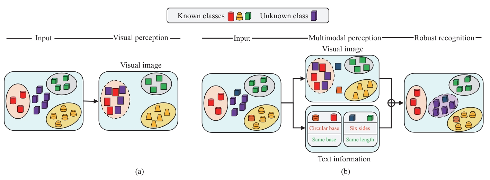

# Logit prototype learning with active multimodal representation for robust open-set recognition



This repository contains the code for the paper:

**Logit prototype learning with active multimodal representation for robust open-set recognition**

Published at SCIENCE CHINA Information Sciences. [Paper](https://link.springer.com/article/10.1007/s11432-023-3924-x)

## Installation

This code is developed on Pytorch. 


## Datasets
You can download the open source dataset and preprocess it as described in the paper, or wait for us to organize it and provide a download link.

## Running Code
### Training and test
```bash
python LPL.py 
```

If you use this work, please cite:

```text
@article{fu2024logit,
  title={Logit prototype learning with active multimodal representation for robust open-set recognition},
  author={Fu, Yimin and Liu, Zhunga and Wang, Zicheng},
  journal={Science China Information Sciences},
  volume={67},
  number={6},
  pages={162204},
  year={2024},
  publisher={Springer}
}
```